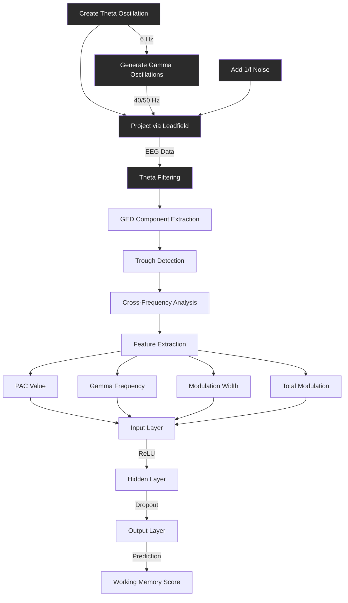

# GED_PAC_WM_PREDICTIVE_MODEL
This is a demo of the predictive model of the working memory performance from the multivariate generalized eigendecomposition phase-amplitude coupling values extracted from the EEG data

# PAC-Based Working Memory Prediction

This project demonstrates the use of Phase-Amplitude Coupling (PAC) features to predict working memory performance using linear predictive model. It serves as a proof of concept for using EEG PAC features to predict cognitive performance.

## Overview

The project consists of 3 main parts:
1. Data generation
2. Multivariate generalized eigendecomposition phase-amplitude coupling
3. Working Memory Score Prediction using Neural Networks


[Previous content remains identical until after the Overview section]

## Analysis Pipeline



[Rest of the README content remains identical]

# 1. EEG Data Simulation for GED-PAC Analysis

## Overview

The simulation creates synthetic EEG data with known theta-gamma coupling patterns to test and validate PAC analysis methods. The simulated data includes:
- A theta oscillation (~6 Hz)
- Two different gamma oscillations:
  1. A theta-locked gamma (40 Hz)
  2. An independent gamma (50 Hz)
- Realistic 1/f noise background

## Theta-Gamma Coupling Visualization


The figure above shows two key aspects of the simulation:
1. **Top Panel**: Theta-locked gamma oscillations
   - Blue line: Normalized theta oscillation (6 Hz)
   - Red line: Normalized gamma oscillation (40 Hz)
   - Notice how gamma amplitude increases during specific phases of theta
   
2. **Bottom Panel**: Non-locked gamma oscillations
   - Green line: Independent gamma oscillation (50 Hz)
   - Shows no systematic relationship with theta phase
   - Demonstrates natural amplitude variations

This visualization confirms that our simulation successfully creates:
- Phase-amplitude coupling between theta and the first gamma oscillation
- Independent gamma activity that serves as a control condition

## Components

### 1. Dipole Configuration
Three main dipoles are simulated:
- Theta dipole (index 94)
- Gamma/theta coupled dipole (index 109)
- Independent gamma dipole (index 111)


### 2. Signal Generation

#### Theta Oscillation
```python
# Create nonstationary theta oscillation (6 Hz)
theta_freq = 6
ampl1 = 5 + 10 * filterFGx(np.random.randn(n_timepoints), srate, 1, 30)
freqmod1 = signal.detrend(10 * filterFGx(np.random.randn(n_timepoints), srate, 1, 30))
theta_wave = ampl1 * np.sin(2*np.pi * theta_freq * times + 2*np.pi/srate * np.cumsum(freqmod1))
```

#### Gamma Oscillations
```python
# Theta-locked gamma (40 Hz)
gamma_freq = 40
theta_phase = np.angle(hilbert(theta_wave))
mod1 = 0.1 + 0.9 * (1 + np.real(np.exp(1j * theta_phase))) / 2
gamma1_wave = mod1 * np.sin(2*np.pi * gamma_freq * times)

# Independent gamma (50 Hz)
ampl2 = 2 + 5 * filterFGx(np.random.randn(n_timepoints), srate, 1, 30)
freqmod2 = signal.detrend(10 * filterFGx(np.random.randn(n_timepoints), srate, 1, 30))
gamma2_wave = ampl2 * np.sin(2*np.pi * 50 * times + 2*np.pi/srate * np.cumsum(freqmod2))
```

### 3. Noise Generation
- Creates correlated 1/f noise
- Projects noise through leadfield matrix
- Adds realistic spatial correlations


## Signal Characteristics

### Time Domain
The simulated signals show clear:
- Theta oscillations with varying amplitude
- Gamma bursts that are phase-locked to theta
- Independent gamma activity
- Realistic background noise

### Frequency Domain
The power spectrum shows:
- Dominant theta peak around 6 Hz
- Gamma peaks around 40 Hz and 50 Hz
- 1/f background noise profile

# 2. Phase-Amplitude Coupling Analysis for Working Memory Prediction via multivariate generalized eigendecomposition PAC

## Analysis Pipeline

### 1. Theta Component Extraction via GED
First, we extract the theta component using Generalized Eigendecomposition (GED):


- Left: Power spectra showing clear theta peak in both component and filtered signals
- Right: Channel spectrum demonstrating raw EEG frequency content
- Bottom: GED eigenvalues showing component separation

### 2. Theta Component Characteristics
The extracted theta component shows clear oscillatory behavior:


- Clean theta oscillations at ~6 Hz
- Stable amplitude modulation
- Clear cyclic pattern

### 3. Trough Detection and Analysis
We detect troughs in the theta signal for phase-based analysis:


- Top: Theta component with detected troughs (magenta dots)
- Bottom: Data visualization around a specific trough showing spatial distribution of activity across channels

### 4. Frequency-Specific Modulation
Analysis of cross-frequency coupling strength:


- Clear peak in gamma range (40-50 Hz)
- Shows strongest coupling between theta phase and gamma amplitude
- Demonstrates specific frequency bands involved in PAC

### 5. Working Memory Prediction
The extracted PAC features were used to predict working memory performance:
- 2-fold cross-validation
- Mean correlation: 0.387 ± 0.291
- MSE: 22.973 ± 15.734

## Technical Details
- Sampling rate: 1024 Hz
- Theta band: 4-8 Hz
- Gamma band: 30-90 Hz
- Regularized covariance matrices
- AdamW optimizer for neural network

## Key Findings
1. Successful extraction of theta component using GED
2. Clear theta-gamma coupling in expected frequency ranges
3. Proof of concept for PAC-based working memory prediction

### PAC Features Generation

Key features extracted:
- PAC Value: ~2.39
- Gamma Frequency: ~43.9 Hz
- Modulation Width: ~28.7 Hz
- Total Modulation: ~83.2

### Deep Learning Model

Architecture:
```python
WMPredictor(
  (layers): Sequential(
    (0): Linear(in_features=4, out_features=6, bias=True)
    (1): BatchNorm1d(6)
    (2): ReLU()
    (3): Dropout(p=0.2)
    (4): Linear(in_features=6, out_features=1, bias=True)
  )
)
```

Training Features:
- Batch size: 3
- AdamW optimizer
- Weight decay: 0.01
- MSE loss function

## Dependencies
- PyTorch
- NumPy
- Pandas
- scikit-learn
- MNE-Python
- SciPy
- Matplotlib

## References
- Original MATLAB implementation by Mike X Cohen
- Cohen, M. X. (2017). Multivariate cross-frequency coupling via generalized eigendecomposition

